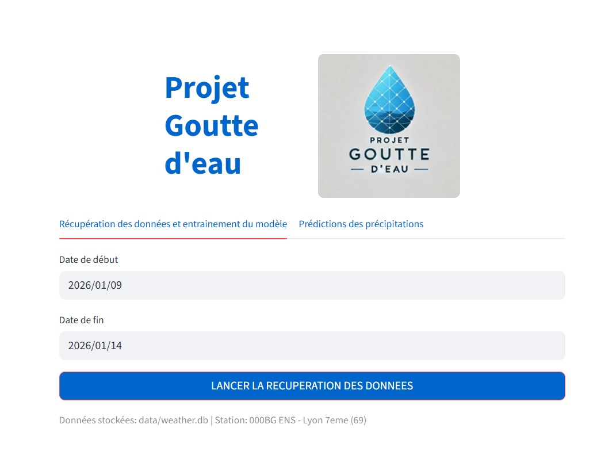
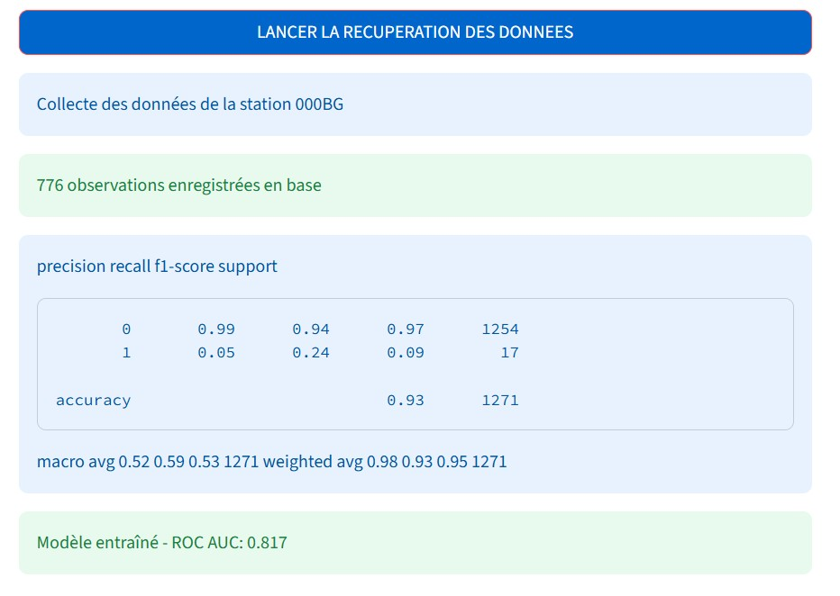
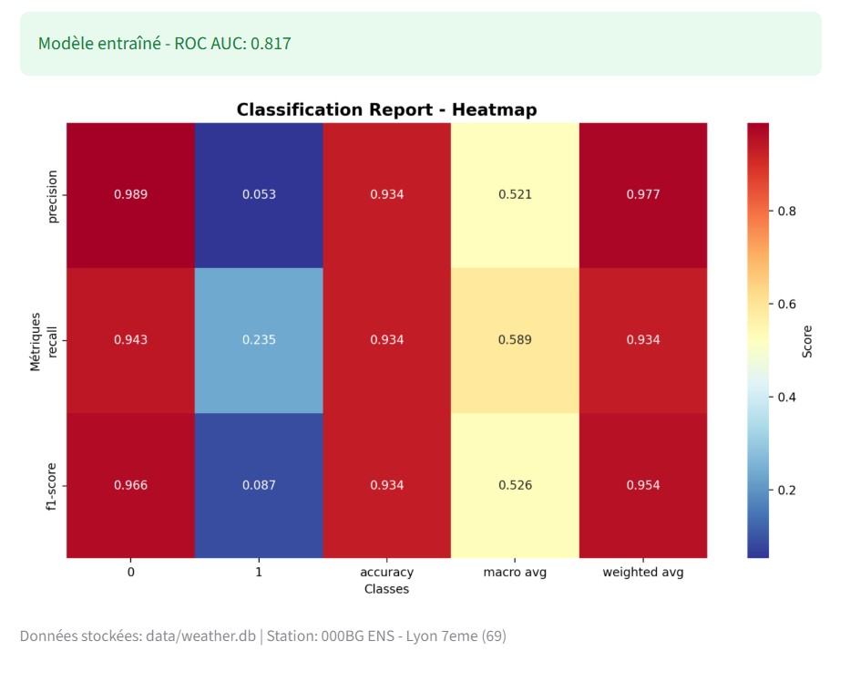
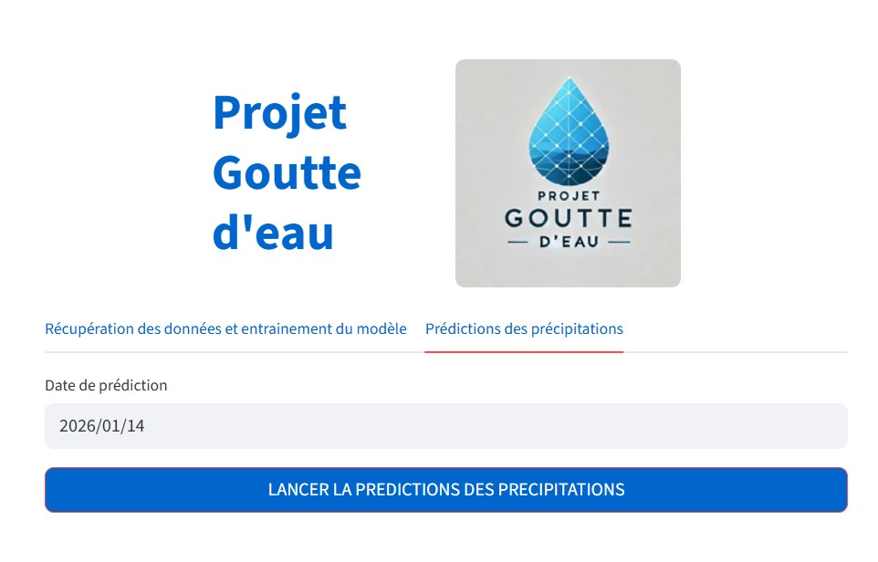
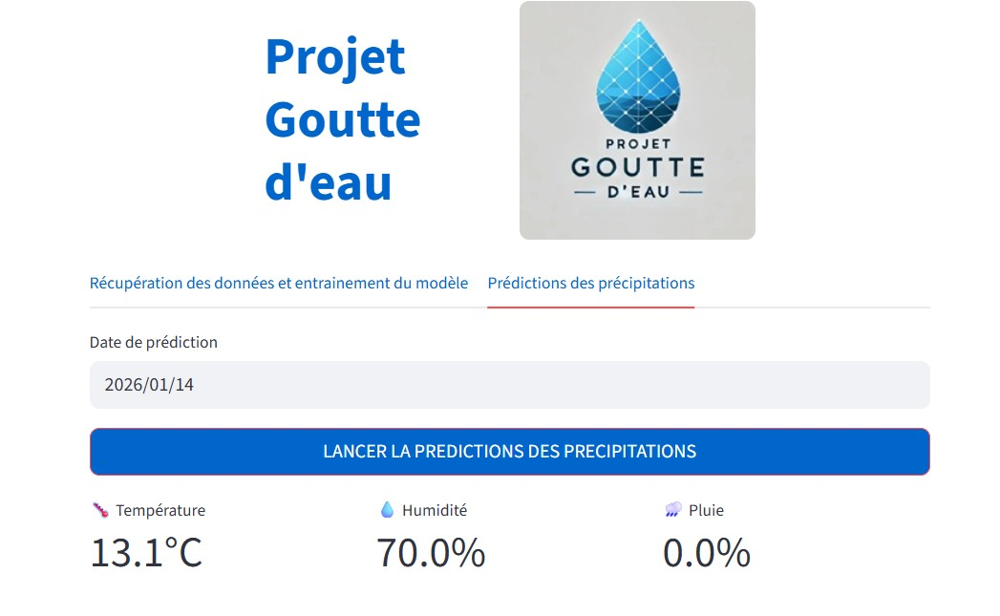

**PREREQUIS**
 

Les packages a installer sont les suivants :
  

 - fastapi
 - uvicorn[standard]
 - pydantic
 - joblib
 - numpy
 - pandas
 - requests
 - scikit-learn
 - matplotlib
 - seaborn
 - streamlit
 

**ARCHITECTURE LOGICIELLE**

  

**predict_api.py** : Rain Prediction API - FastAPI Service

API REST prédisant la probabilité de pluie pour une date donnée en utilisant un modèle ML entraîné.

 

Logique métier :

 - Récupère les 5 dernières observations météo (température, pression,
   humidité, vent, heure, mois)
  - Calcule moyenne pondérée (plus de poids au plus récent)
  - Prédit via modèle scikit-learn + imputer
  - Retourne probabilité pluie + métriques actuelle
 

**infoclimat_client.py** : Infoclimat OpenData API v2 Client - Station 000BG (hourly)

Client HTTP pour récupérer les données météo horaires d'une station Infoclimat sur une période donnée.

  

Logique métier :

 - Batchs intelligents : découpe les requêtes longues en tranches (ex: 30 jours max)
 - Sessions HTTP : réutilise les connexions (performance)
 - Gestion d'erreurs : continue même si 1 batch échoue
 - Logging détaillé : trace chaque appel et résultat
 - Parsing JSON : extrait data.hourly.000BG[]

  
**config.py** : Configuration Centralisée

Classe @dataclass unique centralisant toutes les configurations du projet (API, DB, modèles, UI, data mapping).

  

**db.py** : Gestionnaire SQLite Observations Météo Infoclimat

Classe ORM-like pour créer/gérer la table observations_meteo et insérer dynamiquement les données JSON Infoclimat.

  

Logique métier :

 - _init_db() : Créé table avec TOUS les 29+ champs Infoclimat
 - insert_observations() :
	 - Upsert (INSERT OR REPLACE) via UNIQUE(id_station, dh_utc)
	 - Mapping dynamique via config.* constants
	 - Batch executemany() ultra-performant
	 - Gestion NULL automatique via .get()

  

**transform.py** : Extractor Observations Hourly - Normalisation JSON Infoclimat

Transforme les réponses brutes JSON Infoclimat en dictionnaires structurés, prêts pour insertion SQLite.

  
**logger_manager.py** : LoggerManager - Système de logging singleton production-ready

Singleton configurant automatiquement des loggers structurés avec rotation de fichiers + console pour tout le projet.

  

**model.py** : Model - Entraînement RandomForest + Évaluation Streamlit

Entraîne un classificateur RandomForest pour prédire la pluie (pluie_1h > 0) et visualise les performances dans Streamlit.

  

**app.py** : Application Streamlit complète

Interface utilisateur principale avec 2 onglets pour le pipeline ETL + ML + prédictions en temps réel.

  

**FONCTIONNEMENT**

  

1/ Récupération des données, entrainement du modèle et évaluation du modèle

  

1.1/ Double cliquer sur le fichier *install_package*, cela aura pour effet d'installer tous les packages pour l'application (fastapi uvicorn[standard] pydantic joblib numpy pandas requests scikit-learn matplotlib seaborn streamlit)

  

2.1/ Doubler cliquer sur *launch_app*, cela lance l'application

  

  

Le premier onglet permet de récupérer les données d'une station (ici 000BG / ENS Lyon 7eme). il est alors nécessaire de choisir les dates de début et de fin de la période à sauvegarder en base de données. Par défaut la date de fin est initialisé à la date du jour et celle de début 5 jours avant.

En cliquant sur le bouton "LANCER LA RECUPERATION DES DONNEES", l'application appelle l'API InfoClimat sauvegarde les données dans une base de données SQLite, entraine le modèle et l'évalue.

Le nombre d'observation météo, la précision, le recall et le F1-Score sont affichés :

  

  

ainsi qu'une heatmap :

  

2/ Prédiction de la probabilité de pluie

  

2.1/ Double cliquer sur *launch_AP*I qui aura pour effet d'initialiser l'API qui sera alors accessible via l'URL : http://localhost:8000/docs

  

  

2.2/ Il est possible de tester l'API en cliquant sur l'onglet "Prédiction des précipitations"

  

  

2.3/ Choisir une date de prédiction et cliquer sur le bouton "LANCER LA PREDICTION DES PRECIPITATIONS"

La prédiction de température, de l'humidité et de la pluie s'affiche alors :

  

